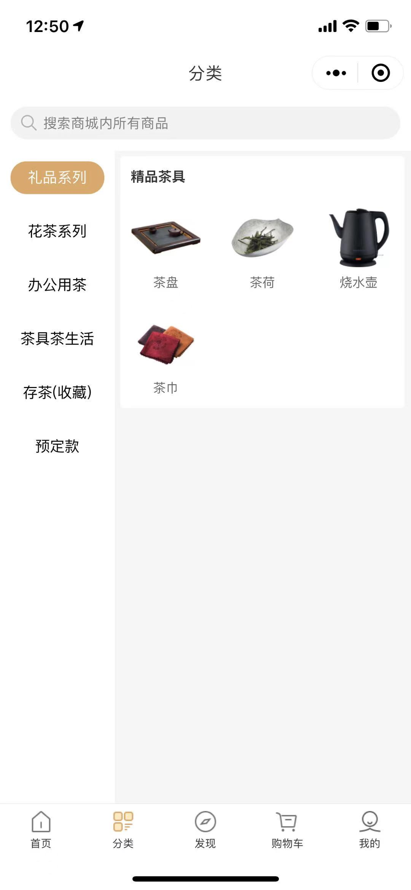
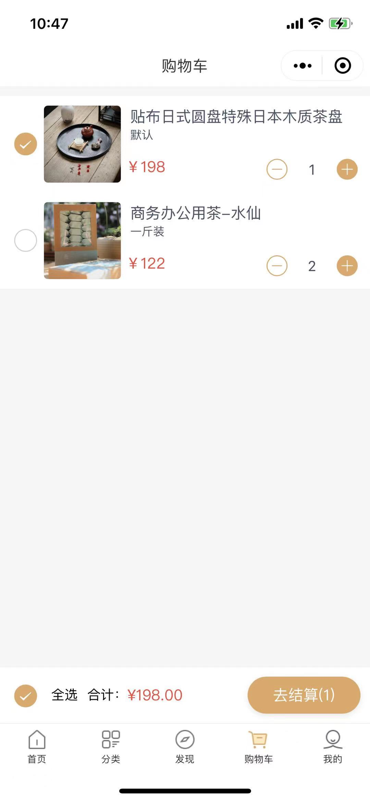
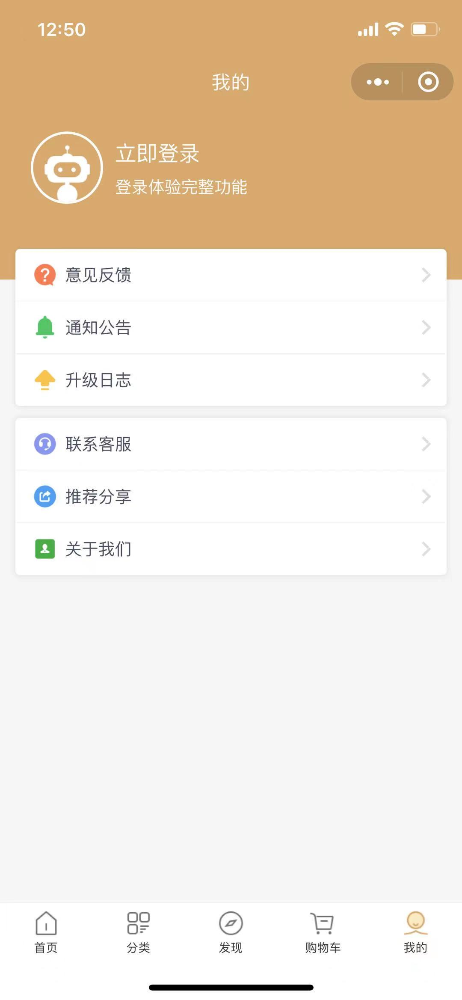

# 智鲸云商城

[](https://gitee.com/ibaleine-open-source/ibaleine-weapp/stargazers)
[](https://gitee.com/ibaleine-open-source/ibaleine-weapp/members)

[](https://github.com/icjs-cc/ibaleine-weapp.git)

## 介绍
基于原生小程序框架的商城项目

## 目录说明
```
-biz-components 业务组件（biz-组件名称）
-components 组件（组件名称）
-pages 页面
-itriton 组件库（t-组件名）
-styles 公共样式库
-utils 工具
	-api
		-modules 各模块接口
		-request request封装
	-common 原生方法二次封装
	-config 配置文件
	-router 路由文件
	-util 常用工具方法
```

## 项目截图
 
 
 
 
 

## 开发者信息
 

## 其他项目

