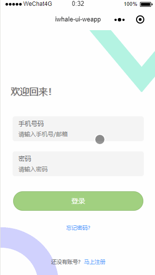

#  iwhale-ui-weapp

#### 介绍

> 微信小程序UI组件及商城模板

#### 实现组件

##### 基础组件

* 轮播图（swiper）
* 自定义顶部导航栏（nav-bar）
* 菜单栏（menu-bar）
* 按钮（button）
* 输入框（input）
* 数字输入框（input-number）
* 标签页（tabs）
* 头像（avatar）
* 卡片（card）
* 无线信号（signal）
* 分割线（divider）
* 列表（cell）
* 标题栏（title-bar）

##### 业务组件
* 商品列表

##### 页面
* 首页
* 登录页面
* 发现页面
* 分类页面
* 个人中心

##### 插件
* wx-validate（表单校验）

#### 效果

#### 代码托管

* GitHub: https://github.com/n551wv1/iwhale-ui-weapp
* 码云: https://gitee.com/n551wv1/iwhale-ui-weapp